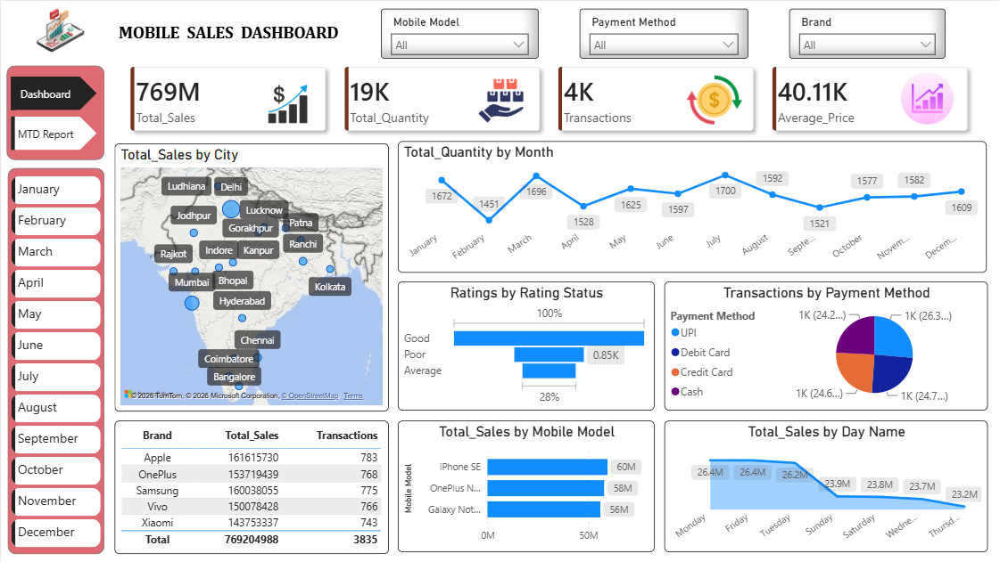
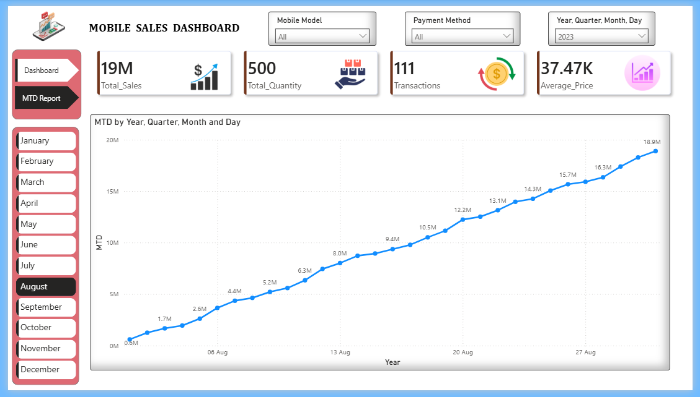

# E-Commerce_Sales_Analysis

## 📌 Project Overview

This Power BI dashboard provides an interactive analysis of mobile phone sales performance across different cities, brands, payment methods, and time periods.

The dashboard enables business users to monitor KPIs, analyze sales trends, compare brand performance, and make data-driven decisions.

---

## 📊 Dashboard Preview



## 📊 MTD Report



---

## 📈 Key Performance Indicators (KPIs)

- Total Sales
- Total Quantity Sold
- Total Transactions
- Average Selling Price

---

## ✨ Dashboard Features

### ⚡ Sales Overview

- Total Sales
- Total Quantity
- Total Transactions
- Average Price

### 🔘 Geographic Analysis

- Sales by City
- Interactive Map Visualization

### ⌛ Time Analysis

- Monthly Sales Quantity
- Day-wise Sales Trend
- Month-to-Date (MTD) Sales Report

### ✨ Brand Analysis

- Sales by Brand
- Brand-wise Transactions

### 💰 Product Analysis

- Top Performing Mobile Models

### 💡 Customer Insights

- Rating Distribution
- Payment Method Analysis

---

## ⚡ Filters Available

- Mobile Model
- Brand
- Payment Method
- Month
- Date (Year, Quarter, Month, Day)

---

## ⚒️ Tools Used

- Power BI Desktop
- Microsoft Excel
- Power Query
- DAX

---

## 💡 Business Insights

- Identifies top-performing brands.
- Tracks monthly sales trends.
- Monitors city-wise sales performance.
- Analyzes preferred payment methods.
- Measures customer ratings.
- Evaluates Month-to-Date (MTD) sales growth.

---

## 📁 Repository Structure

```
E-Commerce_Sales_Analysis/
│
├── README.md
├── Dashboard.png
├── E-commerce_sales_Dashboard.pbix
├── MTD Report.png
└── Mobile Sales Data-1.xlsx
```

---

## ▶️ How to Use

1. Download the repository.
2. Open the `.pbix` file using Power BI Desktop.
3. Refresh the dataset if required.
4. Explore the dashboard using the available filters.

---

## 👩‍💻 Author

**Urmila Deshmukh**
